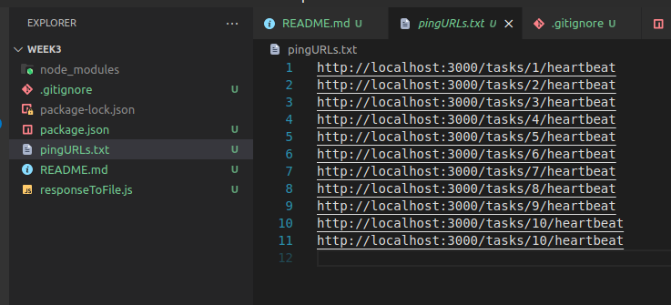

# Task Generation 

### Execution Flow:

1) collectionRunner.js
2) generate_tasks.js
3) taskrunner.js

### Setup Guide

1) Make sure you have mongo db and postman installed on your system
2) Make sure you first get the server running (follow steps in the other repo). Dont proceed further unless this is done.
3) Open postman. Note that there is a postman collection in this folder which i have attached. On the left side, you will see the 'collection' tab. Open the given collection with postman. Now click on the POST request 'new_task' and go to Scripts tab. In 'Pre-request script', you will see a list of user IDs at the top. Remember the users created in the last repo? You need to put their user IDs here. You can open MongoDB compass, then open your database and find the IDs from the users table. Copy Paste them into the script.
4) clone the github repo and cd into the directory
5) run ```npm i```
6) run ```npm run start```
7) You will now have all the tasks created in your database (you can see it using the mongosh or compass gui). Also a txt file called ```pingURLs.txt``` (sample attached below) will get generated. If you dont want to read from the database, you can just use the file for convinience. Do whatever is easier.

